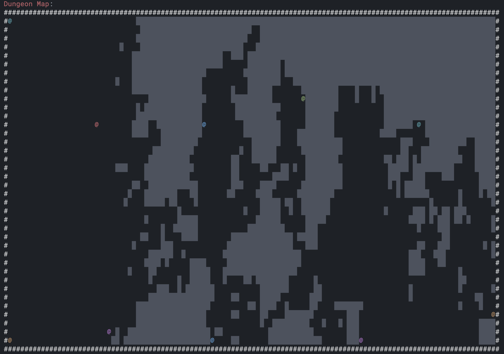

## Ideas, Concepts, and Brainstorming

### Gameplay

- Lobby-based stash, hideout, vendors, etc (Tarkov, The Cycle, Dark and Darker)
- Escape-based gameplay loop to extract with gear
- Very hard mobs (e.g. Dark and Darker/Dark Souls)

### World

- Destructable environment? Takes a few hits to break a wall tile, etc.
- Procedurally generated dungeons/levels
- Example screenshot:
    

### Multiplayer

- Full Loot PvP
- Long-lived dungeons
- Multiple "spawn-in" phases per dungeon

### Classes, Abilities, and Gear

- No fixed classes
- Abilities are tied to weapons
- Only one piece of equippable: weapon
- Altars ('alters') throughout the world add affixes to weapon
- Weapon affixes add both offensive and defensive stats
- Weapon determines active abilities and passives?
- Or just a single ability per weapon to keep it simple?
- Only wands?
- Weapons do not last forever.
  - Magical weapons have charges
  - Non-magical weapons have durability
- Repairing is impossible or outrageously difficult/expensive; perhaps a rare altar
